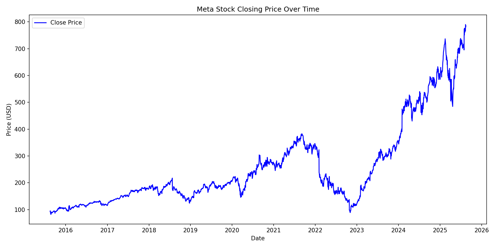
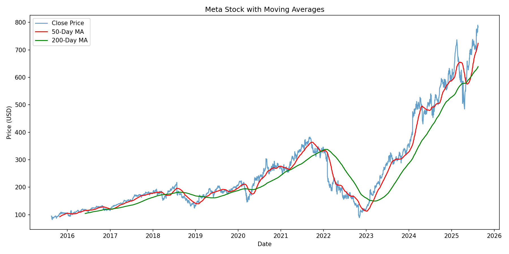
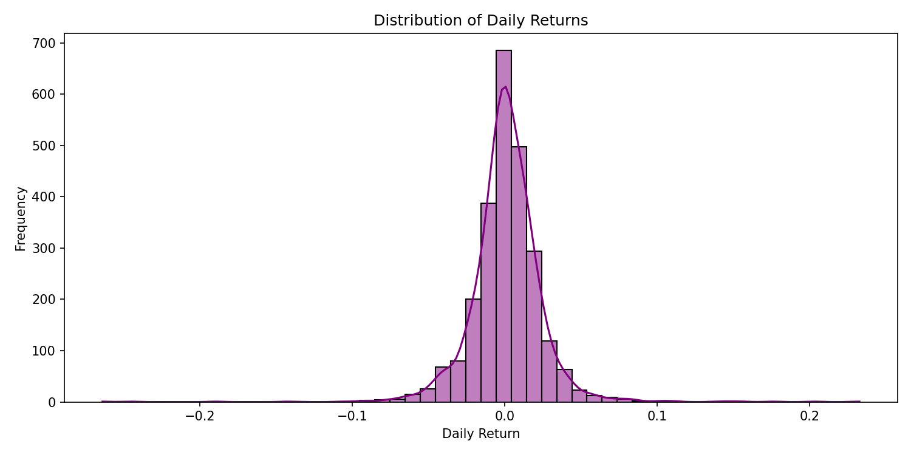
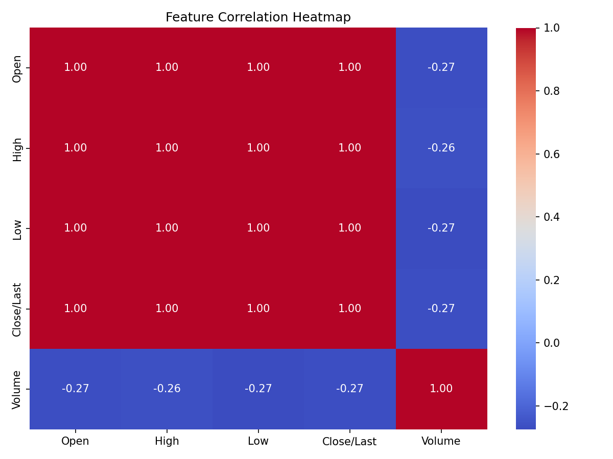
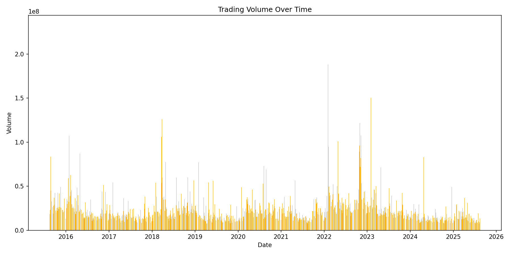
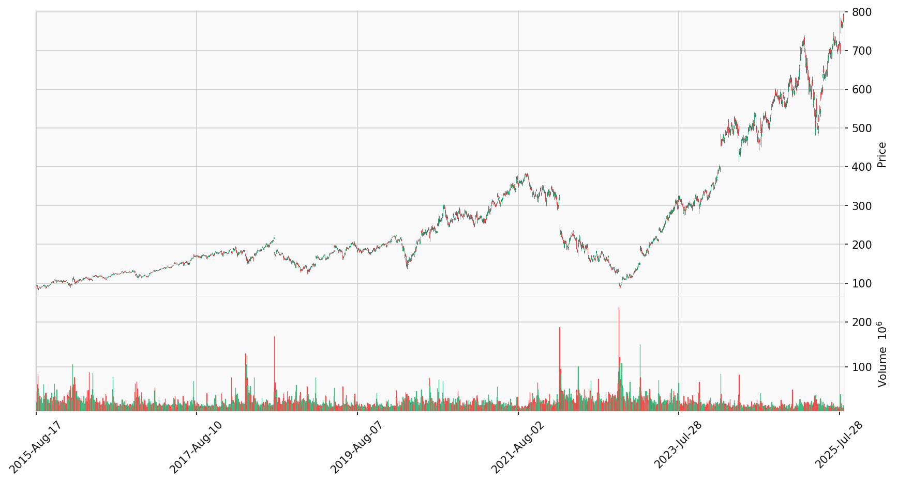
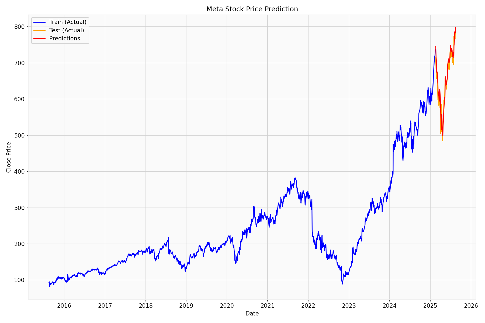

# Meta (META) Stock — LSTM Time Series Forecasting

This project explores Meta's historical stock data and builds a simple LSTM-based model to forecast the closing price.  
It includes quick EDA, a candlestick chart, and a baseline LSTM with sliding windows.

## Dataset
- File: `meta.csv`
- Columns: `Date, Close/Last, Volume, Open, High, Low`
- Notes: Prices contain `$` and are cleaned to floats; dates are parsed as `%m/%d/%Y`.

## What’s inside
- **EDA**: trends, moving averages, returns distribution, correlations, and volume.
- **Candlestick**: OHLC + volume using `mplfinance`.
- **Model**: 2-layer LSTM with a dense head; 60-day lookback; `StandardScaler`.

## Key Visuals

### 1) Closing Price


### 2) Moving Averages (50/200)


### 3) Daily Returns Distribution


### 4) Feature Correlation Heatmap


### 5) Trading Volume Over Time


### 6) Candlestick (OHLC + Volume)


### 7) LSTM Predictions vs. Actuals


## How to run

```bash
pip install -r requirements.txt  # or install the libs below
python main.py
